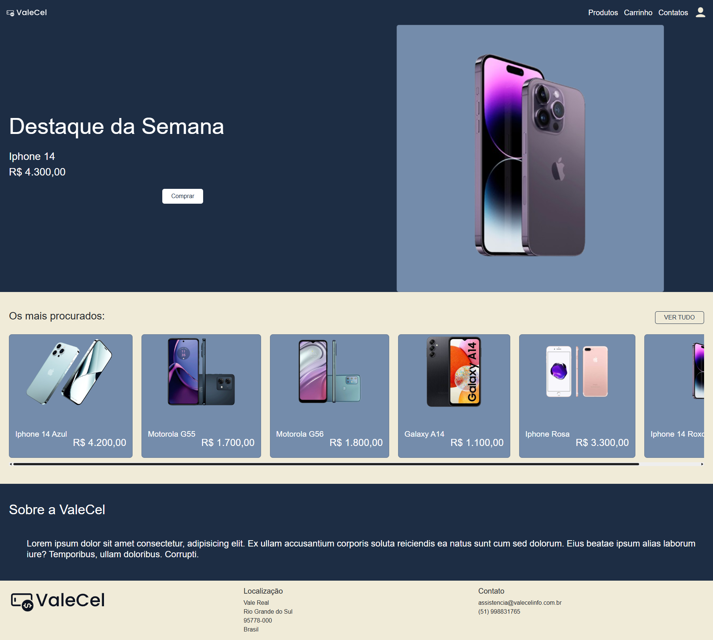
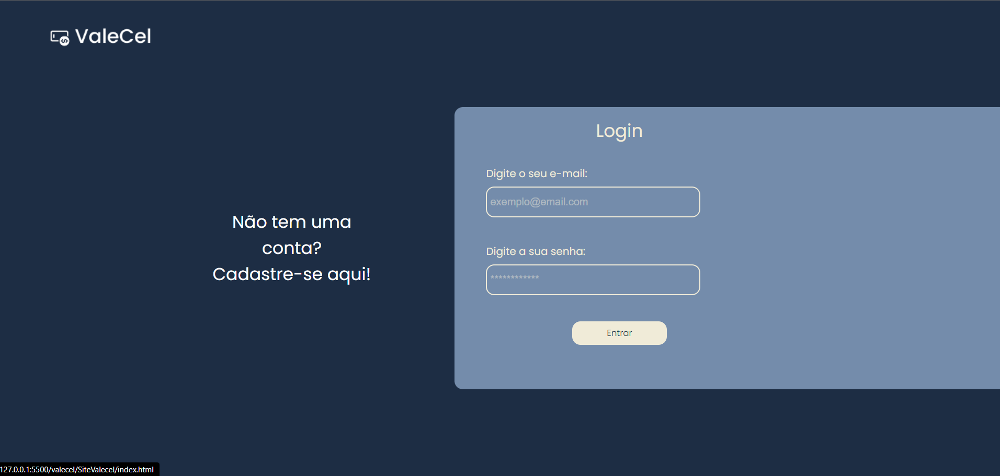
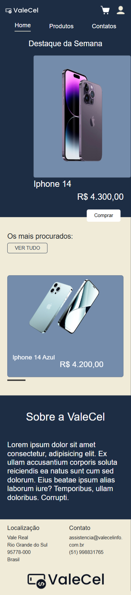
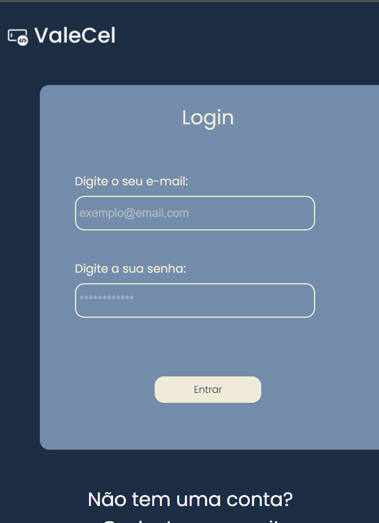

# **ValeCel – E-commerce** 🛒📱

[](https://getbootstrap.com/)
[](https://developer.mozilla.org/pt-BR/docs/Web/HTML)
[](https://developer.mozilla.org/pt-BR/docs/Web/CSS)
[](https://developer.mozilla.org/pt-BR/docs/Web/JavaScript)
[](https://git-scm.com/)
[](https://github.com/)

📌 **Objetivo:**  
O **ValeCel** é um e-commerce desenvolvido como projeto acadêmico da disciplina de **DevOps**.  
O site foi construído com **HTML**, **CSS**, **JavaScript** e **Bootstrap 5**, aplicando práticas de **integração contínua (CI)** e **entrega contínua (CD)**, unindo **Dev** e **Ops**.

---

## **🛠 Tecnologias Utilizadas**
- **HTML5** – Estrutura das páginas  
- **CSS3** – Estilização personalizada  
- **Bootstrap 5** – Layout responsivo e componentes prontos  
- **JavaScript** – Interatividade e funcionalidades do e-commerce  
- **Git & GitHub** – Versionamento e repositório remoto  
- **Práticas DevOps** – Integração contínua, automação e colaboração  
- **Pipeline CI/CD** – Entrega contínua e integração com repositórios  

---

## **🔄 Integração Dev + Ops**
Este projeto aplica o conceito de DevOps para unir:  
- **Desenvolvimento (Dev):** Criação do código, design e experiência do usuário.  
- **Operações (Ops):** Versionamento, automação de tarefas e pipeline de entrega contínua.  

**Principais práticas aplicadas:**  
✔ Uso de **GitHub** para versionamento e colaboração  
✔ Pull Requests para revisão de código  
✔ Deploy automatizado (CI/CD)  
✔ Estrutura modular e organizada do código 

---

## **🚀 Como Executar o Projeto**
```bash
# 1. Clone o repositório
git clone https://github.com/usuario/valecel-ecommerce.git

# 2. Acesse a pasta do projeto
cd valecel-ecommerce

# 3. Abra o arquivo index.html no navegador

```
---

## **📐 Design do Projeto**
🔗 **[Link para o design no Figma](https://www.figma.com/design/OQJo4cKiByeNXGuylFfw8i/Valecel?node-id=0-1&t=wgvi57z2oRUOqkiU-1)**  

---

## **👥 Equipe**
|    Nome    |      Setor      |
|------------|-----------------|
| Alessandro | Desenvolvimento |
| Rebecca    | Desenvolvimento |
| Bianca     | Desenvolvimento |
| Willian    | Desenvolvimento |
| Rickelmy   | Desenvolvimento |
| Natan      | Desenvolvimento |
| Jenifer    | UI/UX Design    |
| Éverd      | Segurança       |
| Lucas      | Segurança       |
| Daniel     | Segurança       |
| Jean       | Segurança       |
| Everaldo   | Operações       |
| Andrei     | Operações       |
| Francielle | Operações       |
| Germano    | Operações       |

---

## 🖼️ Screenshots Desktop 💻





## 🖼️ Screenshots Mobile 📱





