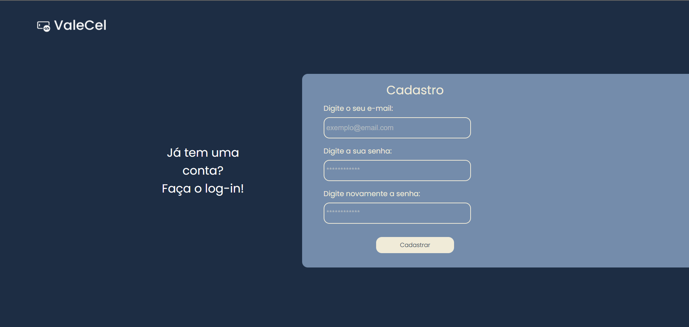

<<<<<<< HEAD
# **ValeCel – E-commerce** 🛒📱

[](https://getbootstrap.com/)
[](https://developer.mozilla.org/pt-BR/docs/Web/HTML)
[](https://developer.mozilla.org/pt-BR/docs/Web/CSS)
[](https://developer.mozilla.org/pt-BR/docs/Web/JavaScript)
[](https://git-scm.com/)
[](https://github.com/)

📌 **Objetivo:**  
O **ValeCel** é um e-commerce desenvolvido como projeto acadêmico da disciplina de **DevOps**.  
O site foi construído com **HTML**, **CSS**, **JavaScript** e **Bootstrap 5**, aplicando práticas de **integração contínua (CI)** e **entrega contínua (CD)**, unindo **Dev** e **Ops**.

---

## **🛠 Tecnologias Utilizadas**
- **HTML5** – Estrutura das páginas  
- **CSS3** – Estilização personalizada  
- **Bootstrap 5** – Layout responsivo e componentes prontos  
- **JavaScript** – Interatividade e funcionalidades do e-commerce  
- **Git & GitHub** – Versionamento e repositório remoto  
- **Práticas DevOps** – Integração contínua, automação e colaboração  
- **Pipeline CI/CD** – Entrega contínua e integração com repositórios  

---

## **🔄 Integração Dev + Ops**
Este projeto aplica o conceito de DevOps para unir:  
- **Desenvolvimento (Dev):** Criação do código, design e experiência do usuário.  
- **Operações (Ops):** Versionamento, automação de tarefas e pipeline de entrega contínua.  

**Principais práticas aplicadas:**  
✔ Uso de **GitHub** para versionamento e colaboração  
✔ Pull Requests para revisão de código  
✔ Deploy automatizado (CI/CD)  
✔ Estrutura modular e organizada do código 

---

## **🚀 Como Executar o Projeto**
```bash
# 1. Clone o repositório
git clone https://github.com/usuario/valecel-ecommerce.git

# 2. Acesse a pasta do projeto
cd valecel-ecommerce

# 3. Abra o arquivo index.html no navegador

```
---

## **📐 Design do Projeto**
🔗 **[Link para o design no Figma](https://www.figma.com/design/OQJo4cKiByeNXGuylFfw8i/Valecel?node-id=0-1&t=wgvi57z2oRUOqkiU-1)**  

---

## **👥 Equipe**
|    Nome    |      Setor      |
|------------|-----------------|
| Alessandro | Desenvolvimento |
| Rebecca    | Desenvolvimento |
| Bianca     | Desenvolvimento |
| Willian    | Desenvolvimento |
| Rickelmy   | Desenvolvimento |
| Natan      | Desenvolvimento |
| Jenifer    | UI/UX Design    |
| Éverd      | Segurança       |
| Lucas      | Segurança       |
| Daniel     | Segurança       |
| Jean       | Segurança       |
| Everaldo   | Operações       |
| Andrei     | Operações       |
| Francielle | Operações       |
| Germano    | Operações       |

---

## 🖼️ Screenshots Desktop 💻




## 🖼️ Screenshots Mobile 📱


=======
<!-- Trigger workflow: alteração para forçar execução do GitHub Actions -->
# ValeCel – E-commerce

## Visão Geral do Projeto

O ValeCel é um projeto de e-commerce desenvolvido como estudo de automação de testes e validação de páginas web. O objetivo é garantir a qualidade da homepage e de páginas relacionadas, utilizando testes automatizados com Robot Framework e SeleniumLibrary, além de documentação BDD (Gherkin).

O projeto contempla:
- Estrutura de site responsivo com HTML, CSS e JavaScript
- Página inicial com destaque de produto, preço, botão de compra e imagem
- Integração de testes automatizados para validação de elementos essenciais
- Pipeline de CI/CD sugerido para execução dos testes

## Estrutura do Projeto

```
cenariosDeTestes/
  suites/
    validarMenuseItensDaPagina.robot   # Testes automatizados Robot Framework
    validacao_conteudo_paginas.feature # Cenários BDD Gherkin
SiteValecel/
  index.html, enviarform.js, css/, imagens/  # Código-fonte do site
log.html, output.xml, report.html           # Relatórios de execução dos testes
```

## Tecnologias Utilizadas
- HTML5, CSS3, JavaScript
- Robot Framework (linguagem de automação dos testes)
- SeleniumLibrary
- Gherkin (BDD)
- Git & GitHub

## Como Instalar e Executar os Testes Automatizados (Robot Framework)

Os testes automatizados deste projeto são escritos em Robot Framework, uma linguagem de automação de testes baseada em palavras-chave, fácil de ler e manter.

### Instalação do Robot Framework e dependências

1. **Instale o Python 3:**
   - Baixe e instale o Python em https://www.python.org/downloads/
   - Certifique-se de adicionar o Python ao PATH durante a instalação.

2. **Instale o Robot Framework:**
   Abra o terminal (PowerShell ou CMD) e execute:
   ```
   pip install robotframework
   ```

3. **Instale o SeleniumLibrary:**
   ```
   pip install robotframework-seleniumlibrary
   ```

4. **Instale o navegador Chrome e o ChromeDriver:**
   - Baixe o Google Chrome: https://www.google.com/chrome/
   - Baixe o ChromeDriver compatível: https://chromedriver.chromium.org/downloads
   - Extraia o executável do ChromeDriver e coloque-o em uma pasta do PATH (ou na mesma pasta do projeto).

5. **(Opcional) Instale o Robot Framework Browser para outros navegadores:**
   ```
   pip install robotframework-browser
   rfbrowser init
   ```

### Como Executar os Testes

1. Na raiz do projeto, execute:
   ```
   robot cenariosDeTestes/suites/validarMenuseItensDaPagina.robot
   ```
2. Os relatórios serão gerados em `log.html`, `report.html` e `output.xml`.

### Observações Importantes
- Os seletores dos testes foram ajustados para garantir robustez e compatibilidade com a página pública.
- O delay entre os testes permite visualização manual da execução.
- Caso a estrutura do site mude, os seletores XPath podem precisar de atualização.
- O pipeline de CI/CD pode ser configurado para rodar os testes automaticamente a cada push.

## Cenários e Testes Automatizados

### Plano de Teste: Validação de Conteúdo das Páginas do Site ValeCel
### Ciclo de Teste: Ciclo de Testes de Conteúdo – Páginas Iniciais

#### Página Inicial (https://sitevalecel.valecelinfo.com.br/index.html)

1. **Validar título "Destaque da Semana"**
   - Garante que o título da seção destaque está presente.
2. **Validar exibição do produto "Iphone 14"**
   - Verifica se o nome do produto está visível.
3. **Validar exibição do preço "R$ 4.300,00"**
   - Confirma a presença do preço correto do produto.
4. **Validar exibição do botão "Comprar"**
   - Valida se o botão de compra está visível e acessível.
5. **Validar exibição da imagem do produto**
   - Garante que a imagem do produto em destaque está visível.

#### Segunda Página (https://www.hostgator.com.br/)
6. **Validar a presença do texto "HostGator"**
   - Confirma que o texto "HostGator" está presente na página.

## Contribuição
- Para contribuir, faça um fork do repositório, crie uma branch, realize suas alterações e envie um pull request.
- Dúvidas ou sugestões podem ser abertas como issues no GitHub.

---

**Desenvolvido para fins de estudo e demonstração de automação de testes em e-commerce.**
# trigger workflow
# trigger workflow again
# trigger workflow via actions
# trigger workflow after branch rename
# trigger workflow after fixing branch name in workflow
# trigger workflow after yaml fix
# trigger workflow after yaml force-fix
# trigger workflow after yaml clean-fix
# trigger workflow after full yaml replace
# trigger workflow after full yaml recreation
# trigger workflow after full yaml overwrite
# trigger workflow after yaml overwrite again
# trigger workflow after yaml overwrite final
# trigger workflow after yaml overwrite with explicit on
# trigger workflow after yaml overwrite with explicit on (final)
# trigger workflow to test execution
>>>>>>> testesValidosQa
